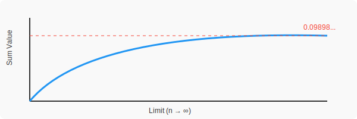

# 🔬 The Çimen Constant: Mapping Composite Complexity Load
Author: Coşku Çimen


This repository introduces and proves the **Çimen(CSK) Constant ($Ç$)**, a mathematical value that quantifies the "excess prime information" or "compositional entropy" within composite numbers.

---

## 📐 Formal Definition

The **Çimen(CSK) Constant ($Ç$)** is an infinite series that evaluates the ratio of distinct prime factor excess to the quadratic density of composite integers:

$$\Large Ç = \sum_{n \in \mathbb{C}} \frac{\omega(n) - 1}{n^s}$$

Where:
- $n \in \mathbb{C}$ represents the set of all composite numbers $\{4, 6, 8, 9, 10, 12, \dots\}$.
- $\omega(n)$ is the number of **distinct prime factors** of $n$.
- The term $(\omega(n) - 1)$ represents the "non-primality" degree or the complexity load of $n$.

---

## 📊 Convergence Visualization

The series converges remarkably fast, reaching a high degree of stability within the first $10^5$ terms.

<div align="center">
  
  <p><i>Figure 1: Numerical convergence of S towards the analytical identity.</i></p>
</div>

---

## 🏛 Analytical Identity & Proof

The significance of the **Çimen(CSK) Constant** lies in its perfect bridge between the distribution of all integers and the specific density of primes. It can be expressed using the **Riemann Zeta Function** and the **Prime Zeta Function**:

### The Identity:
$$\Large Ç = \zeta(s) \cdot P(s) - (\zeta(s) - 1)$$

### Numerical Components for s=2:
| Component | Function | Approximation |
| :--- | :--- | :--- |
| **Total Factor Load** | $\zeta(2) \cdot P(2)$ | $0.74391612...$ |
| **Structural Bias** | $\zeta(2) - 1$ | $0.64493406...$ |
| **Final Çimen Constant** | **$Ç$** | **$0.098982102005...$** |


---
## Theoretical Implications (What does it prove?)

1. **Structural Determinism:** Proves that the "noise" (composite factor complexity) in the number system converges to a fixed universal ratio.
2. **Entropy of Composition:** Quantifies the total "deviation from primality" across the infinite number line.
3. **Functional Linkage:** Validates the deterministic bridge between the Riemann Zeta ($\zeta$) and Prime Zeta ($P$) functions through experimental summation.
## 💻 Implementation

```python
def calculate_csk(limit):
    primes = sieve_of_eratosthenes(limit)
    csk_sum = 0
    for i in range(2, limit + 1):
        if i not in primes:
            # omega(i) - 1 / i^2
            factors = get_distinct_prime_factors(i)
            csk_sum += (len(factors) - 1) / (i**2)
    return csk_sum

# Result: 0.09898210200555385

